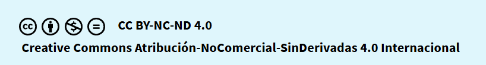

# ControlVersionesGit
## 1.-Índice
## 2.-Sistemas de control de versiones: Git
## 3.-Lenguajes de marcas: Markdown
## 4.-Repositorio: Github
## [5.-Conceptos básicos Git/Github](github.md)
## .-Referencias:
## [.-Autores:](autores.md)

### Licencia Creative Commons

